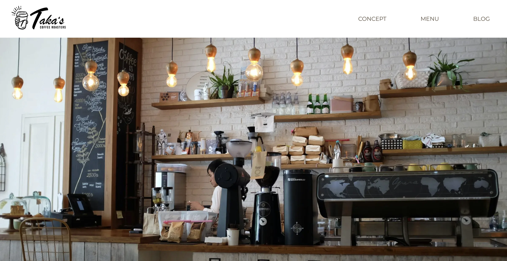
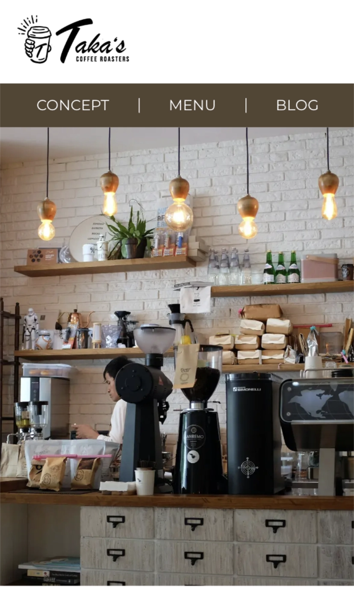

# Taka's Coffee - Next.js

  
  
    
  
    
  

    <a href="#overview">Overview</a> •
    <a href="#what-i-learned">What I Learned</a> •
    <a href="#tech-stack">Tech Stack</a> •
    <a href="#license">License</a>
  

 

## Overview

This project is a Next.js frontend that I planned alongside my previous custom WordPress theme project. It uses the same WordPress instance hosted on AWS Lightsail as a headless CMS and presents the same content through a separate frontend with a different design.

I had already built several projects using Next.js with microCMS, so the basic headless CMS architecture itself was not new to me. However, since WordPress is one of the most widely used CMS platforms, I wanted to apply the same architecture to WordPress and gain experience working with its REST API and content structures.

By building both versions as part of the same plan, I was able to work with the same content through two different approaches: a traditional WordPress theme and a Next.js frontend.

For the traditional WordPress version built as part of the same project plan, see the companion repository: 
[WordPress Custom Theme Project](https://github.com/hidaka88jp/portfolio--takascoffee--wp)

 

## What I Learned

### Data Fetching with the WordPress REST API

**Building Request URLs and Data-Fetching Utilities** 
In this project, I learned how to build request URLs for the WordPress REST API by combining the base path, `/wp-json/wp/v2/`, with endpoints for pages, posts, and custom post types. I also learned how to use query parameters such as `slug`, `_embed`, `include`, and `_fields` to control which content was retrieved and how the response was structured.

When implementing each data-fetching utility, I first created the request URL and opened it in the browser to inspect the returned JSON. I checked whether the response contained the data I needed and how that data was nested. Based on the actual response, I defined raw API response types, designed separate UI-facing types, and added transformation logic inside the utility functions before passing the data to components.
  

**Using Response Headers in Data Fetching** 
While implementing pagination, I learned that the response body alone did not tell me how many pages of results were available in total. I then learned that the WordPress REST API provides pagination information such as `X-WP-Total` and `X-WP-TotalPages` in the response headers, and that these values can be inspected using the browser’s Network panel.

I used `X-WP-TotalPages` to determine how many pages of blog posts were available. This was used both for the blog listing page and for retrieving all blog entries when generating the dynamic sitemap. Through this implementation, I learned to inspect the complete HTTP response rather than focusing only on the returned JSON.
  

**Error Handling and Fallback Design** 
In this project, I learned to distinguish between different failure states instead of handling every failed request in the same way. When a request succeeded but returned no matching content, I treated it as missing content and used `notFound()`. When the request itself failed, I rethrew the error because the application could not determine whether the content existed. The corresponding `error.tsx` file could then display a dedicated fallback UI.

In previous projects, I often caught fetch errors and returned an empty array so that the page could continue rendering without breaking. While this kept the UI stable, it did not distinguish between an empty result and a failed request. In this project, I learned to choose the fallback based on the role of the data. A failure to load the main content displays an error UI, while a failure to load optional data, such as previous and next post links, does not prevent the main page content from being displayed.
  

### Rendering and Caching with Next.js

**Adapting to Current Next.js Patterns** 
While working on this project, I learned that Next.js provides rendering and caching approaches based on Cache Components that differ from the methods I had previously learned through tutorials and books. I decided to enable Cache Components in this project and try these different patterns while referring to the official documentation.

When using Cache Components, components that retrieve uncached data at request time need to be placed within a `Suspense` boundary. To follow this pattern, I separated the data-fetching section from the component that defines the overall page structure and rendered it within `Suspense`. I also gained some initial experience with `use cache` and `cacheLife` while implementing the dynamic sitemap, although caching was not a major focus of this project.

Through this experience, I learned that previously studied approaches do not necessarily apply unchanged to every Next.js project, and I recognized the importance of checking the latest official documentation for the version and configuration being used.
  

## Tech Stack

<table>
  <tr>
    <th>Frontend</th>
    <td>
      
      
      
    </td>
  </tr>
  <tr>
    <th>CMS / API</th>
    <td>
      
    </td>
  </tr>
    <tr>
    <th>Deployment</th>
    <td>
      
    </td>
  </tr>
  <tr>
    <th>Code Quality</th>
    <td>
      
      
      
    </td>
  </tr>
</table>

> The WordPress instance used as the headless CMS was originally created for my [previous WordPress theme project](https://github.com/hidaka88jp/portfolio--takascoffee--wp) and is hosted on AWS Lightsail.

 

## License

This project was created for educational and portfolio purposes.

The source code in this repository is licensed under the [MIT License](./LICENSE).

The UI design was adapted from the
[Mosha Shugyo cafe coding exercise](https://moshashugyo.com/lessons/cafe).
The original design and materials provided by Mosha Shugyo are not covered by
this repository's MIT License.

Please refer to the
[Mosha Shugyo website](https://moshashugyo.com/)
for its terms and portfolio usage requirements.
